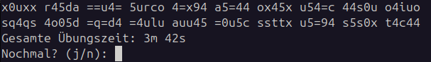
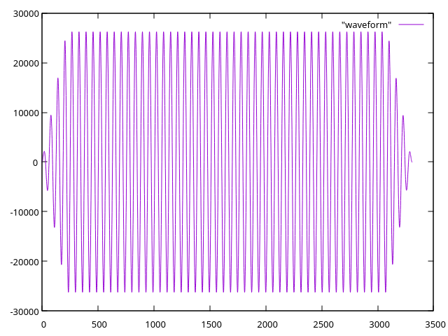

# Morsetrainer
Es gibt schier unendlich viele Programme, die einem dabei helfen sollen Morsen zu lernen. Jetzt ist es noch eins mehr.

## Verwendung
Es ist ein Konsolenprogramm, also gerne in der Konsole starten. Es werden keine Parameter unterstützt. Alle Einstellungen sind in der config.toml zu tätigen, die im gleichen Verzeichnis wie die Executable liegen muss.

## Funktionen
Die Applikation stellt im wesentlichen die folgenden Funktionen zur Verfügung, die ich in absteigender Reihenfolge bei anderen Programmen vermisst habe.

- Es werden eine einstellbare Anzahl an Zeichen in fünfer Blöcken ausgegeben. Man soll sie auf Papier mitschreiben. Erst am Ende werden die Zeichen auf dem Bildschirm angezeigt zum Vergleichen.
- Benutzer kann verwendete Zeichen selbst auswählen
- Es können bestimmte Zeichen intensiv geübt werden. Diese kommen häufiger vor.
- Einstellung der Geschwindigkeit und Abstände
- Die aktive Übungsdauer wird angezeigt und kann mit den persönlichen Zielen abgeglichen werden
- Frequenz kann (auch für Dit und Dah separat) eingestellt werden

### Hintergrund
Es gab zunächst Probleme mit Clipping (Knarzen auf dem Lautsprecher), das ich versucht habe mit Fading in den Griff zu bekommen. Letztlich hat sich herausgestellt, dass Null-Samples das Phänomen beheben. Deshalb wird jetzt einfach die komplette Ausgabespur durchgesamplet. Pausen sind also Samples mit Wert 0. Bei einer Samplerate von 44100 Hz ergibt das etwa 5 MB pro Minute, die man an RAM sicherlich zur Verfügung hat.

